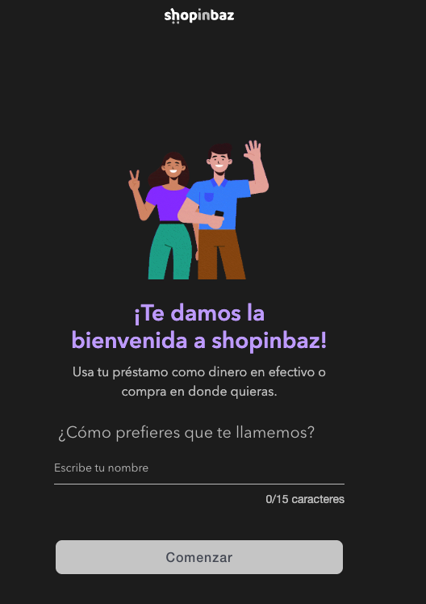

# Examen Práctico — Frontend (Natch / cliente Upax)

> Transcripción del documento original `ExamenPractico_Front.docx`.

## Objetivo

Desarrollar una aplicación web que permita capturar, procesar y mostrar información
del usuario, considerando principios de arquitectura escalable, reutilización de
componentes y personalización entre plataformas.

## Requerimientos funcionales

La aplicación debe permitir:

- **Capturar el nombre del usuario** mediante:
  - Entrada manual (input)
  - Dictado por voz (puedes utilizar APIs nativas, librerías o servicios de IA)
- **Enviar la información a un backend en Node.js** que:
  - Reciba el nombre encriptado
  - Lo desencripte para su procesamiento
  - Genere un número consecutivo
  - Regrese este número encriptado al frontend
- **En el frontend:**
  - Desencriptar el valor recibido
  - Mostrar el resultado al usuario

## Personalización y reutilización (obligatorio)

La aplicación debe estar diseñada para ser reutilizable y adaptable a diferentes
plataformas o marcas.

Debe permitir:

- **Cambiar dinámicamente:**
  - Textos
  - Colores
  - Estilos visuales
- **La personalización debe realizarse mediante:**
  - Parámetros de configuración (ej. JSON, variables de entorno, props, etc.)
  - Sin modificar la lógica interna de los componentes
- **Los componentes deben ser:**
  - Reutilizables
  - Desacoplados de estilos específicos
  - Diseñados como si fueran parte de un sistema multi-plataforma (white-label)

## Requerimientos técnicos

- **Frontend:** React o Angular
- **Backend:** Node.js (Express u otro)
- **Estilos:** Uso de framework CSS (ej. Tailwind u otro)
- **Control de versiones:** Subir el proyecto a un repositorio (GitHub, GitLab, etc.)

## Puntos adicionales

- Implementar pruebas unitarias
- Subir la aplicación a un entorno accesible (deploy)
- Integrar una base de datos en la nube (ej. Firebase, MongoDB, etc.)
- Buen manejo de estructura y organización del código

## Criterios de evaluación

- Claridad y calidad del código
- Estructura y escalabilidad
- Reutilización de componentes
- Manejo de configuración y personalización
- Buenas prácticas de desarrollo
- Documentación (README con explicación de decisiones)

## 💡 Nota importante

Se espera que la solución esté diseñada pensando en su posible integración en
múltiples aplicaciones, manteniendo la misma lógica pero permitiendo adaptaciones
visuales y de contenido mediante configuración.

---

## Maquetas (imágenes del documento)

El documento incluye dos capturas de **la misma pantalla** renderizada con **dos
marcas distintas** (ejemplo white-label):

### Marca 1 — shopinbaz

- Logo: **shopinbaz**
- Color de acento: **morado**
- Título: "¡Te damos la bienvenida a shopinbaz!"
- Subtítulo: "Usa tu préstamo como dinero en efectivo o compra en donde quieras."
- Pregunta: "¿Cómo prefieres que te llamemos?"
- Input: placeholder "Escribe tu nombre", contador **0/15 caracteres** (máx. 15)
- Botón: "Comenzar"

### Marca 2 — Elektra (Préstamo Elektra)

- Logo: **elektra**
- Color de acento: **rojo/naranja**
- Título: "¡Te damos la bienvenida a Préstamo Elektra!"
- Mismo subtítulo, misma pregunta, mismo input (0/15) y mismo botón "Comenzar".

> **Conclusión:** un solo código y misma lógica; solo cambian logo, colores,
> ilustración y textos vía configuración por marca.
